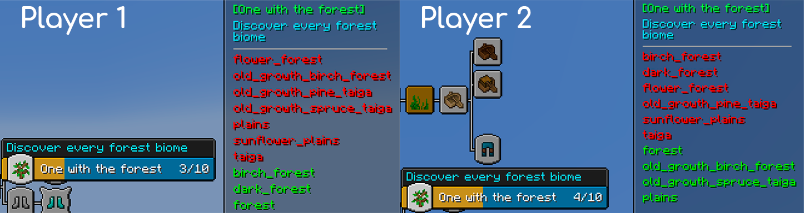
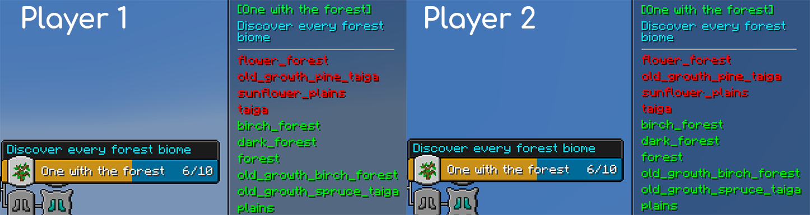

## BACAP Criteria Sync

**An addon for BlazeAndCaves Advancements Pack that adds synchronization of advancement criteria**

What does this mean?
There are advancements that require completing several criteria, for example (this advancement has three criteria):

Currently, BACAP already supports Co-op/Team Co-op mode, but the problem is that only the advancements themselves are synchronized, not their criteria. This datapack was created to fix this issue.

## Example

Before:  

After:  

#### With the datapack, players have the same criteria for advancement

## Supported datapacks

Currently, the latest CriteriaSync supports these datapacks:
- [BACAP itself](https://modrinth.com/datapack/blazeandcaves-advancements-pack) (version 1.18.1)
- [BACAP Hardcore Addon](https://modrinth.com/datapack/blazeandcaves-advancements-pack-hardcore-version) (for BACAP 1.18.1)
- [BACAP Terralith Addon](https://www.planetminecraft.com/data-pack/blazeandcave-s-advancements-pack-terralith-version/?ysclid=m5ty0m7gh5674162971) (for BACAP 1.18.1)
- [BACAP Amplified Nether Addon](https://www.planetminecraft.com/data-pack/blazeandcave-s-advancements-pack-terralith-version/?ysclid=m5ty0m7gh5674162971) (for BACAP 1.18.1)
- [BACAP Nullscapes Addon](https://www.planetminecraft.com/data-pack/blazeandcave-s-advancements-pack-terralith-version/?ysclid=m5ty0m7gh5674162971) (for BACAP 1.18.1)
- [Enhanced Discoveries](https://modrinth.com/datapack/bacap-enhanced-discoveries) (version 2.4.10)
- [Enhanced Discoveries Hardcore Addon](https://modrinth.com/datapack/bacap-enhanced-discoveries-hardcore-addon) (version 2.4.10)
- [Cereal Dedication](https://www.planetminecraft.com/data-pack/blazeandcave-s-advancements-pack-cereal-dedication/) (version 1.6)
- [Cereal Dedication Hardcore](https://www.planetminecraft.com/data-pack/blazeandcave-s-advancements-pack-cereal-dedication/) (version 1.6)
- [Complete Collection](https://www.planetminecraft.com/data-pack/bacap-complete-collection-edition/) (version 2.1.0)
- [BACAP Incendium Addon](https://modrinth.com/datapack/blazeandcaves-advancements-pack-incendium-version) (version 1.18)

#### To install the correct version of this addon for BACAP/its addons, see the table in the description of the datapack releases.

## Limitations and Excluded Advancements

There are advancements that criteria synchronization leads to significant changes, often unjustified easing. Such advancements do not synchronize criteria between players, for example, "The Perfect Run" from BACAP or "High Pitch" from Enhanced Discoveries.

[Full list of such advancements](should_be_ignored.json)

If you know of more advancements that should not synchronize criteria, please report them in an [Issue on GitHub](https://github.com/Komaru-cats/BACAP-CriteriaSync/issues) or on the Discord server [KomaruCats](https://discord.com/invite/j9VKsyXPhz).

## Installation instructions are as follows:

For a new world: You can click the "Data Packs" option when creating a new world. Upon doing this, either open the world folder and copy in the zipped file, or click and drag the zipped file directly into the menu. Once it is imported, mouse over the icon for CriteriaSync so an arrow appears, then click the arrow to load the datapack.

For an existing world: Click on the world in the singleplayer menu, then click "Edit", then "Open World Folder". Then go into the "datapacks" folder, and copy and paste the zipped file from the download here.

Once the datapack is installed, go into the world. A message should pop up that CriteriaSync is installed.

## Bugs or Improvements

If you have any questions, bugs, suggestions, you can [create an issue on GitHub](https://github.com/Komaru-cats/BACAP-CriteriaSync/issues) or [join our discord server](https://discord.gg/j9VKsyXPhz)

Made with [BACAP Parser](https://github.com/ItzSkyReed/BACAP_Parser)
